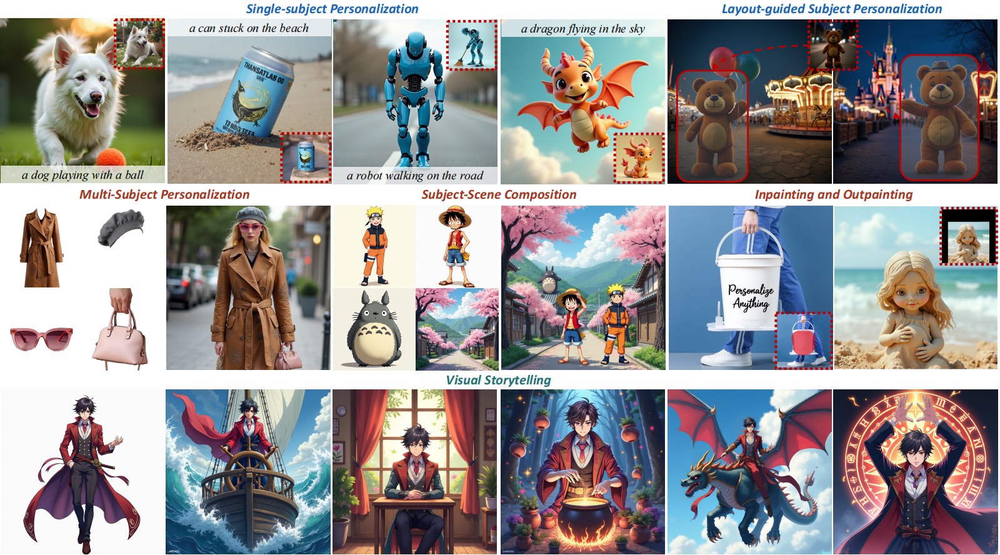

# Easy-to-Use System for Personalize Anything with Diffusion Transformer

<p align="center">
  🌐 <a href="https://fenghora.github.io/Personalize-Anything-Page/">Original Project Page</a> | 
  📄 <a href="https://arxiv.org/abs/2503.12590">Original Paper</a>
</p>

This project aims to provide an **easy-to-use and fully integrated system** for the algorithm proposed in *"Personalize Anything for Free with Diffusion Transformer"*.



The [original implementation](https://github.com/FengHora/Personalize-Anything) by the authors includes:
- A Gradio demo showcasing only inpainting and outpainting.
- Jupyter notebooks demonstrating features like subject shifting and manual mask uploading for single-subject personalization.

However, these features were scattered across different scripts and notebooks, requiring manual operations and lacking a unified interface.  
Our contribution lies in consolidating, enhancing, and optimizing these functionalities into a unified and streamlined system, while also completing most of the key features. Additionally, we optimize memory usage to reduce the memory required for inference.

## Our Contributions

* **Unified Interface:** Combined all major features into a single, user-friendly Gradio demo. Including:
  * Layout-guided subject personalization
  * Multi-subject personalization
  * Inpainting
  * Outpainting
* **Improved Usability:**
  * Automatic subject mask generation.
  * Online manual mask editing for fine-grained control.
  * Seamless workflow across all personalization tasks.
* **Memory Optimization:** Reduced VRAM usage **from 35GB to 9GB** by offloading internal model layers.

## Installation

Clone the repository:

```bash
git clone https://github.com/daichenwww/VFX-final-personalize-anything.git
cd VFX-final-personalize-anything
```

Create a virtual environment:

```bash
conda create -n personalize python=3.10
conda activate personalize
```

Install the required dependencies (ensure PyTorch > 2.0):

```bash
# Install PyTorch (select the appropriate CUDA version)
pip install torch torchvision --index-url https://download.pytorch.org/whl/cu118

# Install other dependencies
pip install -r requirements.txt
```

> [!Note]
> Before getting started, remember to access the token from this [page](https://huggingface.co/black-forest-labs/FLUX.1-dev)

## Quick Start

Run the Gradio demo:

```bash
python gradio_demo.py
```
> [!Note]
> Feel free to use example images in ```example_data``` folder.

## Features & Usage Guide

### 1. Layout-Guided Subject Personalization
- **Purpose:** Personalize specific subjects in images with precise layout control
- **Steps:**
  1. Upload your reference image
  2. Provide a label for the subject
  3. Click "Generate Mask" to automatically detect the subject
  4. Fine-tune the mask using the brush tools
  5. Enter your desired prompt
  6. Adjust parameters and generate

### 2. Multi-Subject Personalization
- **Purpose:** Combine multiple subjects into a coherent scene
- **Steps:**
  1. Upload background subject image
  2. Upload foreground subject image
  3. Provide labels for both subjects
  4. Generate and refine the foreground mask
  5. Enter your composition prompt
  6. Generate the combined scene

### 3. Inpainting
- **Purpose:** Fill missing or unwanted regions in images
- **Steps:**
  1. Upload your image
  2. Use the sketch tool to mark areas to inpaint
  3. Provide a label for the subject you want to replace
  4. Optionally provide a prompt for guided inpainting
  5. Generate the result

### 4. Outpainting
- **Purpose:** Extend images beyond their original boundaries
- **Steps:**
  1. Upload your source image
  2. Provide a label for the subject
  3. Set target dimensions and positioning
  4. Preview the alignment
  5. Generate the extended image

## Parameter Guide

- **Tau (0-100):** Controls local vs global consistency
  - Lower values: Better local consistency, may sacrifice overall harmony
  - Higher values: Better overall harmony, may lose local details
- **Mask Shift (-10 to 10):** Fine-tune subject positioning
- **Number of Inference Steps (1-50):** Quality vs speed tradeoff
  - 28 steps: Good balance for most cases
  - Higher steps: Better quality but slower

## Model Information

This system uses:
- **FLUX.1-dev:** Base diffusion model for image generation
- **GroundingDINO:** Object detection for automatic mask generation
- **SAM (Segment Anything Model):** Precise segmentation
- **Custom Attention Processors:** For personalization control

Models are automatically downloaded on first run and cached locally.

## Citation

This implementation builds upon the official code and methods proposed in the following paper:

```bibtex
@article{feng2025personalize,
  title={Personalize Anything for Free with Diffusion Transformer},
  author={Feng, Haoran and Huang, Zehuan and Li, Lin and Lv, Hairong and Sheng, Lu},
  journal={arXiv preprint arXiv:2503.12590},
  year={2025}
}
```
